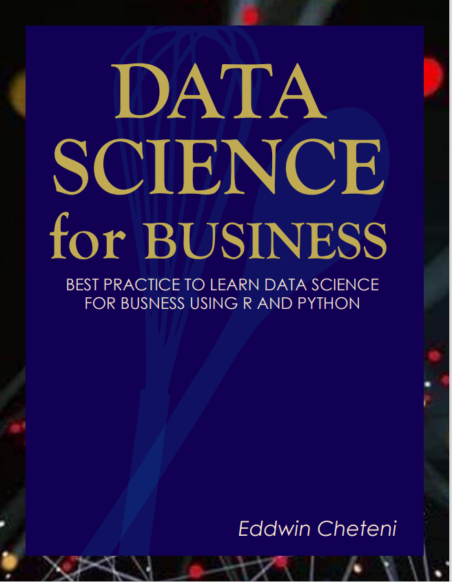

# Preface {}

This e-book is intended to be used for Practical Data Science using either **R** or **Python** language.

The book is organised in such a way that each section expands the use-cases as applied to different fields. Because of this, the sections are not inclusive, i.e. knowledge of the fundamentals will be required in most cases going forward.
